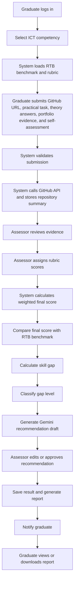

# Skills Gap Analysis Tool for TVET ICT Graduates in Kicukiro District

A full-stack web application for assessing the practical ICT competencies of TVET graduates and comparing their performance against RTB-aligned competency benchmarks. The system supports graduate evidence submission, GitHub project analysis, theory questions, portfolio evidence, assessor rubric scoring, weighted score calculation, gap classification, recommendations, reports, notifications, and role-based dashboards.

## Project Overview

This capstone project helps TVET institutions and assessors identify the gap between the ICT skills graduates currently demonstrate and the competency level expected by RTB standards.

The system is designed around realistic assessment evidence instead of self-reporting only. A graduate submits a GitHub repository or practical project, answers theory questions, adds portfolio evidence, and provides a small self-assessment score. An assessor reviews the evidence using RTB-aligned rubrics, approves scores, and the system calculates the final competency result.

## Main Users

| Role | Main Responsibilities |
| --- | --- |
| Graduate | Register, complete profile, select competency, submit practical/GitHub evidence, answer theory questions, upload portfolio evidence, view gap results, recommendations, reports, and notifications. |
| Assessor | View submitted assessments, review GitHub/practical work, review theory and portfolio evidence, assign rubric scores, generate or approve recommendations, submit final review. |
| Admin | Manage users, competencies, RTB benchmarks, notifications, assessments, reports, and system analytics. |

## Technology Stack

| Layer | Technology |
| --- | --- |
| Frontend | React, Vite, TypeScript, CSS |
| Backend | Node.js, Express.js, ES Modules |
| Database | MongoDB Atlas with Mongoose |
| Authentication | JWT |
| External APIs | GitHub API for repository analysis, Gemini API for recommendation generation |

## Existing Project Structure

```text
RTB-Graduate-project/
  backend/
    src/
      app.js
      server.js
      config/
      controllers/
      middleware/
      models/
      routes/
      services/
      utils/
    package.json
    .env.example

  my-project/
    src/
      api/
      assets/
      components/
      context/
      pages/
      utils/
      App.tsx
      App.css
      main.tsx
      types.ts
    package.json
```

## Backend Layered Architecture

The backend follows a readable layered Express architecture. Requests move from the user interface into the server, pass through routes and middleware, reach controllers, then services, and finally the MongoDB models/database. Responses return through the same layers in reverse.

```text
User / Frontend
   v
backend/src/server.js
   v
backend/src/app.js
   v
backend/src/routes
   v
backend/src/middleware
   v
backend/src/controllers
   v
backend/src/services
   v
backend/src/models
   v
MongoDB Atlas Database
   v
backend/src/models
   v
backend/src/services
   v
backend/src/controllers
   v
backend/src/routes
   v
backend/src/app.js / backend/src/server.js
   v
Frontend / User
```

### Layer Responsibilities

| Layer | Responsibility |
| --- | --- |
| Frontend | Sends authenticated API requests and displays dashboards, forms, results, reports, and notifications. |
| `server.js` | Loads environment variables, connects to MongoDB, and starts the Express server. |
| `app.js` | Creates the Express app, applies global middleware, mounts route modules, and handles unknown routes/errors. |
| `routes/` | Defines API URLs, HTTP methods, route-level middleware, validation checks, role authorization, and controller handlers. |
| `middleware/` | Handles JWT authentication, role authorization, required-field validation, not-found handling, and error responses. |
| `controllers/` | Receives HTTP requests, calls service functions, and sends consistent API responses. |
| `services/` | Contains business logic such as assessment submission, GitHub analysis, Gemini recommendation generation, scoring, gap analysis, reports, notifications, and dashboards. |
| `models/` | Defines Mongoose schemas and communicates with MongoDB collections. |
| Database | Stores users, graduate profiles, competencies, benchmarks, assessments, recommendations, reports, and notifications. |

Example assessment request flow:

```text
Graduate submits assessment
   v
POST /api/assessments
   v
assessmentRoutes.js
   v
authMiddleware.js + roleMiddleware.js + validateMiddleware.js
   v
assessmentController.createAssessment()
   v
assessmentService.submitAssessment()
   v
repositoryAnalysisService.summarizeGitHubRepository()
   v
Assessment / Competency / User / Notification models
   v
MongoDB Atlas
   v
Assessment response returned to frontend
```

## Important Files

| File | Responsibility |
| --- | --- |
| `backend/src/app.js` | Creates the Express app, applies middleware, registers API routes, and handles API health checks. |
| `backend/src/server.js` | Starts the backend server and connects to MongoDB. |
| `backend/src/config/db.js` | Handles MongoDB Atlas connection settings. |
| `backend/src/routes/*.js` | Defines the backend API endpoints by feature. |
| `backend/src/controllers/*.js` | Receives API requests and sends API responses. |
| `backend/src/services/*.js` | Contains main business logic for assessments, scoring, reports, recommendations, dashboards, GitHub analysis, and authentication. |
| `backend/src/models/*.js` | Defines MongoDB collections using Mongoose schemas. |
| `backend/src/utils/scoring.js` | Calculates weighted competency scores. |
| `backend/src/utils/gapClassifier.js` | Calculates and classifies skill gaps. |
| `my-project/src/App.tsx` | Main frontend application view routing by authenticated user role. |
| `my-project/src/api/client.ts` | Central frontend API client. |
| `my-project/src/context/AuthContext.tsx` | Handles login state, token storage, and logout. |
| `my-project/src/pages/AuthPages.tsx` | Homepage, login, and registration screens. |
| `my-project/src/pages/MainPages.tsx` | Main dashboards and pages for graduates, assessors, and admins. |
| `my-project/src/components/layout.tsx` | Application shell, sidebar navigation, and role-based menu. |
| `my-project/src/components/common.tsx` | Reusable UI components. |

## Core Assessment Engine

The system follows this workflow:

1. Graduate logs in.
2. Graduate selects an ICT competency.
3. System loads the selected competency, practical task, theory questions, portfolio requirements, rubric, and active RTB benchmark.
4. Graduate submits evidence:
   - GitHub repository URL
   - Practical task answer or uploaded practical evidence
   - Theory question answers
   - Portfolio link or project description
   - Self-assessment score
5. System validates required evidence.
6. System calls the GitHub API to verify and summarize the repository.
7. Assessor reviews the evidence and repository summary.
8. Assessor assigns scores for each assessment area.
9. System calculates the final weighted competency score.
10. System compares the score with the RTB benchmark.
11. System calculates the skill gap.
12. System classifies the gap level.
13. System generates a recommendation draft using Gemini.
14. Assessor reviews, edits, or approves the recommendation.
15. System saves the final result and notifies the graduate.
16. Graduate views or downloads the assessment report.

### Weighted Scoring Formula

The current scoring model is:

```text
Final Score =
(Practical/GitHub Project Score x 0.60)
+ (Theory Score x 0.20)
+ (Portfolio Evidence Score x 0.15)
+ (Self-Assessment Score x 0.05)
```

This gives the highest weight to practical work and GitHub/project evidence, making the assessment more realistic and less dependent on self-reporting.

### Skill Gap Formula

```text
Skill Gap = RTB Benchmark Score - Graduate Final Score
```

If the calculated value is below zero, the system stores the gap as zero:

```text
If Skill Gap < 0, Skill Gap = 0
```

### Gap Classification

| Gap Value | Gap Level |
| --- | --- |
| 0 | No Gap |
| 1-5 | Very Low Gap |
| 6-15 | Low Gap |
| 16-25 | Moderate Gap |
| Above 25 | High Gap |

## Assessment Flowchart



## GitHub Repository Analysis

When a graduate submits a GitHub URL, the backend attempts to:

- Validate the repository URL format.
- Fetch repository metadata.
- Read supported source code files.
- Read README documentation if available.
- Review recent commits.
- Count supported file types.
- Store a repository summary for assessor review.

The stored summary can include:

```json
{
  "url": "https://github.com/example/student-project",
  "owner": "example",
  "repo": "student-project",
  "isValid": true,
  "description": "Student web app project",
  "defaultBranch": "main",
  "languages": ["JavaScript", "TypeScript", "CSS"],
  "readmeFound": true,
  "supportedFileCount": 24,
  "supportedFileTypes": [
    { "extension": ".js", "count": 10 },
    { "extension": ".tsx", "count": 5 },
    { "extension": ".css", "count": 4 }
  ],
  "codeQualityNotes": [
    "Repository includes README documentation.",
    "Repository contains supported ICT source files."
  ]
}
```

## Gemini Recommendation Integration

The system uses Gemini only to generate a draft recommendation after assessor scores are available. If Gemini credentials are missing or the Gemini request fails, the recommendation endpoint returns an error.

Recommended Gemini environment values:

```env
GEMINI_API_KEY=your_gemini_api_key
GEMINI_RECOMMENDATION_MODEL=gemini-2.5-flash
GEMINI_RECOMMENDATION_API_URL=
```

The recommendation context includes:

- Selected competency
- RTB benchmark score
- Graduate final score
- Skill gap value
- Gap level
- Weak assessment areas
- GitHub repository summary
- Assessor comments

The assessor should review and approve the recommendation before it becomes the final recommendation shown to the graduate.

## Prerequisites

- Node.js
- npm
- MongoDB Atlas database
- GitHub account or public GitHub repository URLs for testing
- Gemini API key for recommendation generation

## Backend Setup

Open a terminal in the backend folder:

```powershell
cd backend
npm install
```

Create a `.env` file using `backend/.env.example`:

```env
PORT=5000
MONGO_URI=mongodb+srv://<db_username>:<db_password>@<cluster-host>/rtb_skills_gap?retryWrites=true&w=majority
JWT_SECRET=replace_with_a_long_random_secret
DB_CONNECT_TIMEOUT_MS=8000
GITHUB_TOKEN=

GEMINI_API_KEY=your_gemini_api_key
GEMINI_RECOMMENDATION_MODEL=gemini-2.5-flash
GEMINI_RECOMMENDATION_API_URL=
```

Start the backend:

```powershell
npm run dev
```

Backend default URL:

```text
http://localhost:5000
```

Health check:

```text
GET http://localhost:5000/api/health
```

## Frontend Setup

Open another terminal in the frontend folder:

```powershell
cd my-project
npm install
```

Optional frontend environment file:

```env
VITE_API_URL=http://localhost:5000/api
```

Start the frontend:

```powershell
npm run dev
```

Frontend default URL:

```text
http://localhost:5173
```

## Available Scripts

Backend:

| Command | Purpose |
| --- | --- |
| `npm run dev` | Start Express backend using nodemon. |
| `npm start` | Start Express backend using Node. |
| `npm run check` | Check backend entry file syntax. |

Frontend:

| Command | Purpose |
| --- | --- |
| `npm run dev` | Start Vite development server. |
| `npm run build` | Build TypeScript and Vite production files. |
| `npm run lint` | Run ESLint. |
| `npm run preview` | Preview production build locally. |

## Authentication

Most API routes require a JWT token.

Send the token using the `Authorization` header:

```http
Authorization: Bearer <token>
Content-Type: application/json
```

Supported roles:

```text
graduate
assessor
admin
```

## Standard API Response Format

Successful responses use this structure:

```json
{
  "success": true,
  "message": "Resource loaded",
  "data": {}
}
```

Error responses use this structure:

```json
{
  "success": false,
  "message": "Error message"
}
```

## API Documentation

Base URL:

```text
http://localhost:5000/api
```

### Health

| Method | Endpoint | Access | Description |
| --- | --- | --- | --- |
| GET | `/health` | Public | Check if the API is running. |

Example response:

```json
{
  "success": true,
  "message": "Skills Gap Analysis API is running"
}
```

### Authentication API

| Method | Endpoint | Access | Description |
| --- | --- | --- | --- |
| POST | `/auth/register` | Public | Register a new user. |
| POST | `/auth/login` | Public | Login and receive JWT token. |
| GET | `/auth/me` | Authenticated | Get current authenticated user. |

Register request:

```json
{
  "name": "Fred Niyonshuti",
  "email": "graduate@example.com",
  "password": "password123",
  "role": "graduate",
  "institution": "Kicukiro TVET College"
}
```

Login request:

```json
{
  "email": "graduate@example.com",
  "password": "password123"
}
```

Auth response:

```json
{
  "success": true,
  "message": "Logged in successfully",
  "data": {
    "user": {
      "id": "USER_ID",
      "name": "Fred Niyonshuti",
      "email": "graduate@example.com",
      "role": "graduate",
      "institution": "Kicukiro TVET College",
      "isActive": true
    },
    "token": "JWT_TOKEN"
  }
}
```

### User Management API

Admin only.

| Method | Endpoint | Description |
| --- | --- | --- |
| GET | `/users` | List users. |
| POST | `/users` | Create user. |
| GET | `/users/:id` | Get one user. |
| PUT | `/users/:id` | Update user. |
| PATCH | `/users/:id/deactivate` | Deactivate user. |

Create user request:

```json
{
  "name": "Assessor User",
  "email": "assessor@example.com",
  "password": "password123",
  "role": "assessor",
  "institution": "Kicukiro TVET College"
}
```

### Graduate Profile API

| Method | Endpoint | Access | Description |
| --- | --- | --- | --- |
| GET | `/graduates/me` | Graduate | Get own graduate profile. |
| PUT | `/graduates/me` | Graduate | Create or update own profile. |
| GET | `/graduates` | Assessor, Admin | List graduate profiles. |
| GET | `/graduates/:userId` | Assessor, Admin | Get profile by graduate user ID. |

Save profile request:

```json
{
  "registrationNumber": "TVET-ICT-2026-001",
  "phone": "+250788000000",
  "gender": "male",
  "district": "Kicukiro",
  "sector": "Niboye",
  "institution": "Kicukiro TVET College",
  "program": "ICT",
  "graduationYear": 2026,
  "specialization": "Web Development",
  "bio": "ICT graduate focused on full-stack web application development."
}
```

### Competency API

| Method | Endpoint | Access | Description |
| --- | --- | --- | --- |
| GET | `/competencies` | Authenticated | List competencies. Supports `activeOnly=true` and `category=value`. |
| POST | `/competencies` | Admin | Create competency. |
| GET | `/competencies/:id` | Authenticated | Get competency details. |
| PUT | `/competencies/:id` | Admin | Update competency. |

Create competency request:

```json
{
  "title": "Web Application Development",
  "code": "ICT-WEB-001",
  "category": "Software Development",
  "description": "Ability to design, build, test, and document a responsive web application.",
  "expectedEvidence": "GitHub repository, deployed or runnable project, README, screenshots, and portfolio explanation.",
  "practicalTasks": [
    {
      "title": "Build a responsive CRUD web module",
      "instructions": "Create a web module that can create, read, update, and delete records with validation and clear UI feedback.",
      "deliverables": "GitHub repository URL, README setup instructions, screenshots, and short implementation explanation.",
      "estimatedMinutes": 120,
      "maxScore": 100
    }
  ],
  "theoryQuestions": [
    {
      "question": "Which HTTP method is normally used to update an existing resource?",
      "type": "multiple_choice",
      "options": ["GET", "POST", "PUT", "DELETE"],
      "correctAnswer": "PUT",
      "points": 5
    },
    {
      "question": "Explain why input validation is important in a web application.",
      "type": "short_answer",
      "expectedAnswer": "Input validation protects data integrity, improves user feedback, and reduces security risks.",
      "points": 10
    }
  ],
  "portfolioRequirements": [
    {
      "title": "Project documentation",
      "description": "Provide README, screenshots, setup steps, and a short explanation of your role.",
      "required": true
    }
  ],
  "rubricCriteria": [
    {
      "name": "Functionality",
      "description": "The submitted project meets the required features and works correctly.",
      "weight": 40,
      "maxScore": 100
    },
    {
      "name": "Code quality",
      "description": "The code is organized, readable, reusable, and maintainable.",
      "weight": 25,
      "maxScore": 100
    },
    {
      "name": "User interface",
      "description": "The interface is clear, responsive, and user-friendly.",
      "weight": 20,
      "maxScore": 100
    },
    {
      "name": "Documentation",
      "description": "The project includes clear setup and usage documentation.",
      "weight": 15,
      "maxScore": 100
    }
  ],
  "isActive": true
}
```

### RTB Benchmark API

| Method | Endpoint | Access | Description |
| --- | --- | --- | --- |
| GET | `/benchmarks` | Authenticated | List benchmarks. Supports `activeOnly=true` and `competency=COMPETENCY_ID`. |
| POST | `/benchmarks` | Admin | Create benchmark. |
| PUT | `/benchmarks/:id` | Admin | Update benchmark. |

Create benchmark request:

```json
{
  "competency": "COMPETENCY_ID",
  "requiredScore": 80,
  "level": "intermediate",
  "description": "RTB-aligned minimum score expected for employable web application development competency.",
  "effectiveFrom": "2026-01-01",
  "isActive": true
}
```

### Assessment API

| Method | Endpoint | Access | Description |
| --- | --- | --- | --- |
| GET | `/assessments` | Authenticated | List assessments. Graduates see their own assessments; assessors see submitted/reviewed assessments. |
| POST | `/assessments` | Graduate | Submit competency assessment evidence. |
| GET | `/assessments/:id` | Authenticated | Get one assessment. |
| PUT | `/assessments/:id/review` | Assessor, Admin | Review assessment, assign scores, calculate gap, save recommendation, and notify graduate. |
| POST | `/assessments/:id/recommendation-preview` | Assessor, Admin | Generate recommendation preview before final review. |
| GET | `/assessments/results/me` | Graduate | Get reviewed gap results for the logged-in graduate. |

Submit assessment request:

```json
{
  "competency": "COMPETENCY_ID",
  "practicalSubmissionMode": "mixed",
  "practicalTaskId": "PRACTICAL_TASK_ID",
  "practicalTask": "I completed the CRUD module with authentication, form validation, and responsive tables. The code is available in the GitHub repository.",
  "githubRepositoryUrl": "https://github.com/example/student-project",
  "theoryAnswers": [
    {
      "questionId": "QUESTION_ID_1",
      "answer": "PUT"
    },
    {
      "questionId": "QUESTION_ID_2",
      "answer": "Input validation protects data integrity, prevents invalid data, improves feedback, and reduces security risks."
    }
  ],
  "portfolioLink": "https://portfolio.example.com/student-project",
  "projectDescription": "A full-stack CRUD web application developed using React and Node.js.",
  "fileUrls": [
    "https://example.com/project-screenshot.png"
  ],
  "evidenceFiles": [
    {
      "name": "screenshot.png",
      "type": "image/png",
      "size": 102400,
      "dataUrl": "data:image/png;base64,BASE64_DATA"
    }
  ],
  "selfAssessmentScore": 75
}
```

Review assessment request:

```json
{
  "rubricScores": [
    {
      "criterionId": "RUBRIC_CRITERION_ID_1",
      "score": 85,
      "comment": "CRUD functionality works and routes are clearly implemented."
    },
    {
      "criterionId": "RUBRIC_CRITERION_ID_2",
      "score": 78,
      "comment": "Code is organized but validation can be improved."
    }
  ],
  "practicalTaskScore": 82,
  "quizScore": 70,
  "portfolioScore": 78,
  "selfAssessmentScore": 75,
  "assessorComment": "The project demonstrates good CRUD functionality and documentation. More attention is needed on validation and error handling.",
  "evidenceVerification": {
    "githubReviewed": true,
    "practicalEvidenceReviewed": true,
    "portfolioReviewed": true,
    "theoryReviewed": true,
    "authenticityNotes": "Repository, README, commits, uploaded screenshot, and portfolio link were reviewed by the assessor."
  },
  "recommendation": {
    "message": "Improve form validation, error handling, and testing before the next assessment.",
    "actionItems": [
      "Add server-side validation for all form inputs.",
      "Improve error messages for failed API requests.",
      "Add basic test cases for important user workflows."
    ],
    "resources": [
      "Express validation documentation",
      "React form handling guide"
    ]
  }
}
```

Recommendation preview request:

```json
{
  "rubricScores": [
    {
      "criterionId": "RUBRIC_CRITERION_ID_1",
      "score": 85,
      "comment": "Functional implementation is mostly complete."
    }
  ],
  "practicalTaskScore": 82,
  "quizScore": 70,
  "portfolioScore": 78,
  "selfAssessmentScore": 75,
  "assessorComment": "The project works, but validation and testing need improvement.",
  "evidenceVerification": {
    "githubReviewed": true,
    "practicalEvidenceReviewed": true,
    "portfolioReviewed": true,
    "theoryReviewed": true,
    "authenticityNotes": "Evidence was checked against the submitted GitHub project and portfolio."
  }
}
```

Assessment review response includes:

```json
{
  "assessment": {
    "scores": {
      "practicalTaskScore": 82,
      "quizScore": 70,
      "portfolioScore": 78,
      "selfAssessmentScore": 75,
      "finalScore": 79.65
    },
    "benchmarkScore": 80,
    "skillGap": 0.35,
    "gapLevel": "Very Low Gap",
    "status": "reviewed"
  },
  "recommendation": {
    "message": "Improve form validation, error handling, and testing before the next assessment.",
    "gapLevel": "Very Low Gap",
    "priority": "low",
    "isApproved": true
  }
}
```

### Recommendation API

| Method | Endpoint | Access | Description |
| --- | --- | --- | --- |
| GET | `/recommendations` | Graduate, Assessor, Admin | List recommendations. Graduates see recommendations linked to their assessments. |

Recommendations are created or updated when an assessor reviews an assessment through:

```text
PUT /api/assessments/:id/review
```

### Report API

| Method | Endpoint | Access | Description |
| --- | --- | --- | --- |
| GET | `/reports` | Graduate, Assessor, Admin | List reports. |
| POST | `/reports` | Graduate, Assessor, Admin | Generate report. |

Generate own graduate report:

```json
{}
```

Generate report for a graduate as assessor/admin:

```json
{
  "graduateId": "GRADUATE_USER_ID"
}
```

Report data includes:

- Graduate
- Generated by
- Reviewed assessments
- Overall score
- Overall gap level
- Strengths
- Weaknesses
- Recommendations

### Notification API

| Method | Endpoint | Access | Description |
| --- | --- | --- | --- |
| GET | `/notifications` | Authenticated | List current user's notifications. |
| POST | `/notifications` | Admin | Create notification for a recipient, role, or all users. |
| GET | `/notifications/manage` | Admin | List all notifications. |
| PATCH | `/notifications/read-all` | Authenticated | Mark all own notifications as read. |
| PATCH | `/notifications/:id/read` | Authenticated | Mark one notification as read. |

Create notification request:

```json
{
  "title": "New RTB Benchmark Published",
  "message": "A new benchmark is available for Web Application Development.",
  "type": "system",
  "role": "graduate",
  "link": "/graduate/results"
}
```

Automatic notifications:

- Assessors are notified when a graduate submits a new assessment.
- Graduates are notified when an assessor reviews an assessment.

### Dashboard API

| Method | Endpoint | Access | Description |
| --- | --- | --- | --- |
| GET | `/dashboard` | Authenticated | Returns role-based dashboard statistics and recent activity. |

The response depends on the logged-in user role:

- Graduate dashboard: profile, submissions, reviewed results, recommendations, reports, notifications.
- Assessor dashboard: submitted assessments, reviewed assessments, pending work.
- Admin dashboard: users, competencies, benchmarks, assessments, reports, system overview.

## Postman Testing Guide

### 1. Test API health

```http
GET http://localhost:5000/api/health
```

### 2. Register or login

```http
POST http://localhost:5000/api/auth/login
```

Body:

```json
{
  "email": "admin@example.com",
  "password": "password123"
}
```

Copy the returned token.

### 3. Add JWT token to protected requests

In Postman Authorization tab:

```text
Type: Bearer Token
Token: JWT_TOKEN
```

### 4. Create competency as admin

```http
POST http://localhost:5000/api/competencies
```

Use the competency JSON example from the Competency API section.

### 5. Create RTB benchmark as admin

```http
POST http://localhost:5000/api/benchmarks
```

Use the benchmark JSON example from the Benchmark API section.

### 6. Submit assessment as graduate

```http
POST http://localhost:5000/api/assessments
```

Use the assessment JSON example from the Assessment API section.

### 7. Preview recommendation as assessor

```http
POST http://localhost:5000/api/assessments/ASSESSMENT_ID/recommendation-preview
```

### 8. Review assessment as assessor

```http
PUT http://localhost:5000/api/assessments/ASSESSMENT_ID/review
```

### 9. View graduate result

```http
GET http://localhost:5000/api/assessments/results/me
```

### 10. Generate report

```http
POST http://localhost:5000/api/reports
```

## Testing GitHub API in Postman

Public repository metadata:

```http
GET https://api.github.com/repos/OWNER/REPO
```

Repository languages:

```http
GET https://api.github.com/repos/OWNER/REPO/languages
```

Recent commits:

```http
GET https://api.github.com/repos/OWNER/REPO/commits?per_page=5
```

Repository tree:

```http
GET https://api.github.com/repos/OWNER/REPO/git/trees/main?recursive=1
```

Recommended headers:

```http
Accept: application/vnd.github+json
X-GitHub-Api-Version: 2022-11-28
Authorization: Bearer YOUR_GITHUB_TOKEN
```

The GitHub token is optional for public repositories but recommended to reduce rate-limit issues.

## Testing Gemini API in Postman

Endpoint:

```http
POST https://generativelanguage.googleapis.com/v1beta/models/gemini-2.5-flash:generateContent?key=YOUR_GEMINI_API_KEY
```

Headers:

```http
Content-Type: application/json
```

Body:

```json
{
  "contents": [
    {
      "parts": [
        {
          "text": "Generate a short ICT skills improvement recommendation for a graduate with a final score of 72, RTB benchmark of 80, and low gap in web application development."
        }
      ]
    }
  ]
}
```

Expected successful response contains text under:

```text
candidates[0].content.parts[0].text
```

## Database Models Summary

| Model | Purpose |
| --- | --- |
| User | Stores account, role, institution, password hash, and active status. |
| GraduateProfile | Stores graduate academic and personal profile details. |
| Competency | Stores ICT competency, practical tasks, theory questions, portfolio requirements, and rubric criteria. |
| Benchmark | Stores active RTB required score for each competency. |
| Assessment | Stores graduate evidence, GitHub summary, scores, benchmark score, skill gap, gap level, review status, and assessor comments. |
| Recommendation | Stores AI draft, final approved recommendation, action items, resources, priority, and approval metadata. |
| Report | Stores generated graduate assessment report summary. |
| Notification | Stores user notifications for submissions, reviews, reports, and system messages. |

## Example Competency and Benchmark Data

### Competency 1: Web Application Development

```json
{
  "title": "Web Application Development",
  "code": "ICT-WEB-001",
  "category": "Software Development",
  "description": "Build responsive, secure, and maintainable web applications using frontend and backend technologies.",
  "expectedEvidence": "GitHub repository, practical task submission, theory answers, portfolio link, README, screenshots, and project explanation.",
  "isActive": true
}
```

Benchmark:

```json
{
  "competency": "COMPETENCY_ID",
  "requiredScore": 80,
  "level": "intermediate",
  "description": "Graduate can build, document, and explain a functional web application aligned with RTB ICT requirements.",
  "isActive": true
}
```

### Competency 2: Database Design and Management

```json
{
  "title": "Database Design and Management",
  "code": "ICT-DB-001",
  "category": "Database Systems",
  "description": "Design normalized database schemas, implement CRUD operations, and apply data validation.",
  "expectedEvidence": "Database schema, ERD, GitHub repository, queries, screenshots, and explanation of relationships.",
  "isActive": true
}
```

Benchmark:

```json
{
  "competency": "COMPETENCY_ID",
  "requiredScore": 78,
  "level": "intermediate",
  "description": "Graduate can design and implement a correct relational or document database for an ICT application.",
  "isActive": true
}
```

### Competency 3: Computer Network Fundamentals

```json
{
  "title": "Computer Network Fundamentals",
  "code": "ICT-NET-001",
  "category": "Networking",
  "description": "Configure basic network settings, explain IP addressing, and troubleshoot common connectivity issues.",
  "expectedEvidence": "Network configuration screenshots, packet tracer file or lab report, theory answers, and troubleshooting explanation.",
  "isActive": true
}
```

Benchmark:

```json
{
  "competency": "COMPETENCY_ID",
  "requiredScore": 75,
  "level": "intermediate",
  "description": "Graduate can configure and troubleshoot basic network environments according to ICT support expectations.",
  "isActive": true
}
```

## Security Notes

- Passwords are stored as salted hashes.
- JWT is required for protected routes.
- Routes are protected by role authorization.
- Graduate users can only view their own assessment records.
- Assessor and admin users can review submitted assessments.
- Admin-only routes manage users, competencies, benchmarks, and system notifications.
- Sensitive environment values must not be committed to GitHub.

## Troubleshooting

### MongoDB Atlas connection error

If you see an error like:

```text
MongoDB connection failed: querySrv ECONNREFUSED _mongodb._tcp...
```

Check:

- Internet connection is working.
- Atlas cluster is running.
- Atlas Network Access allows your current IP address.
- `MONGO_URI` has the correct username, password, and cluster host.
- Database user has read/write permissions.
- Password special characters are URL-encoded.

### Gemini recommendation fails

If the recommendation preview or assessment review returns a Gemini error, check:

- `GEMINI_API_KEY` is set.
- `GEMINI_API_KEY` is valid.
- `GEMINI_RECOMMENDATION_MODEL` is supported by Gemini.
- The request uses `POST`.
- The backend server has internet access.
- Backend server was restarted after editing `.env`.

### GitHub repository analysis fails

Check:

- Repository URL is valid.
- Repository is public or accessible.
- GitHub rate limit is not exceeded.
- The repository contains supported ICT source files.
- README and source files are not too large for API analysis.

## Production Readiness Checklist

- Use a strong `JWT_SECRET`.
- Restrict MongoDB Atlas network access.
- Use HTTPS in production.
- Store environment variables securely.
- Configure CORS for the deployed frontend domain.
- Add file upload storage such as Cloudinary, S3, or local secure storage if large files are required.
- Add backend tests for scoring, gap classification, authentication, and protected routes.
- Add frontend tests for assessment submission, review workflow, and report generation.
- Add audit logs for assessor reviews if required by the institution.
