# Skills Gap Analysis Tool for TVET ICT Graduates in Kicukiro District

A full-stack capstone system for assessing ICT TVET graduate competencies using real evidence, GitHub repository review, theory questions, RTB-aligned benchmarks, Gemini-generated recommendations, notifications, reports, and role-based dashboards.

## Project Purpose

The system helps identify the gap between ICT skills demonstrated by TVET graduates and competency requirements aligned with RTB standards. It avoids relying only on self-reported skills by using:

- GitHub practical evidence or repository-based practical work.
- Theory or quiz answers scored from objective answers and expected short-answer content.
- Automated repository review.
- Weighted scoring.
- RTB benchmark comparison.
- Skill gap classification.
- Gemini recommendation generation.
- User notifications and downloadable reports.


## Project Objectives

The Competra system was developed to achieve the following objectives:

- Assess ICT TVET graduates' competencies using practical GitHub repository evidence and theory assessments.
- Compare graduate competency scores against RTB benchmark scores.
- Automatically calculate competency gaps using a weighted scoring algorithm.
- Generate AI-powered recommendations to help graduates improve identified competency gaps.
- Provide administrators with dashboards, reports, and analytics to support competency management.
- Improve the accuracy and objectivity of competency assessment by reducing reliance on self-reported skills.

## Technology Stack

| Layer             | Technology                                                    |
| ----------------- | ------------------------------------------------------------- |
| Frontend          | React, Vite, TypeScript, Tailwind CSS, Recharts, Lucide icons |
| Backend           | Node.js, Express.js, ES Modules                               |
| Database          | MongoDB Atlas, Mongoose                                       |
| Authentication    | JWT, Google OAuth                                             |
| Email             | Brevo email API for password reset links                     |
| Repository Review | GitHub API, optional repository execution settings            |
| AI Recommendation | Gemini API                                                    |

## Live Demo / Application URL

demo video and live application url :

https://docs.google.com/document/d/1c0gMfJDdh6FZgHur0QYa_gu9NMmWGgFYGAZr0C8HBaY/edit?tab=t.0


# System Screenshots

## Home Page


---

## Login Page


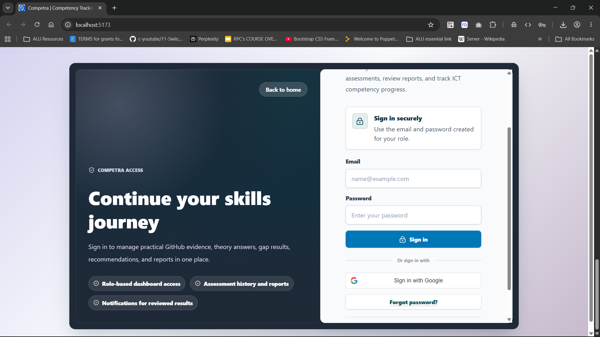

---
## create account Page


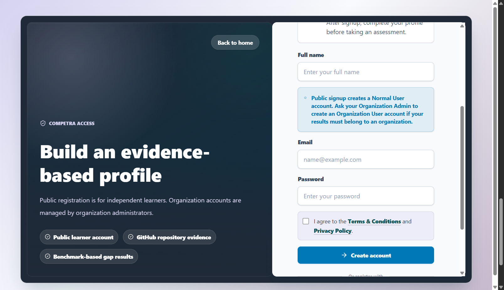

---

## Dashboard


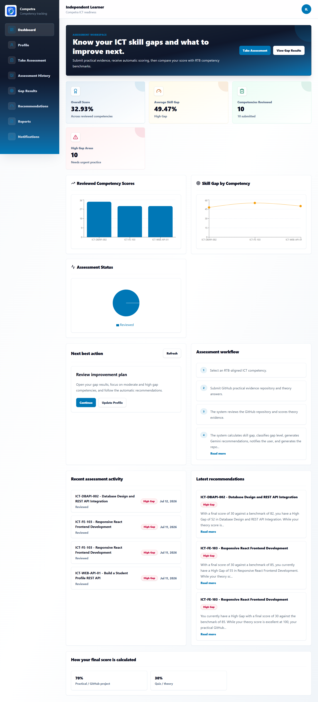

---
## Admin Dashboard


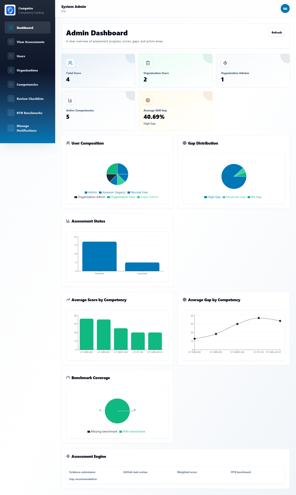

---

## Competency Management


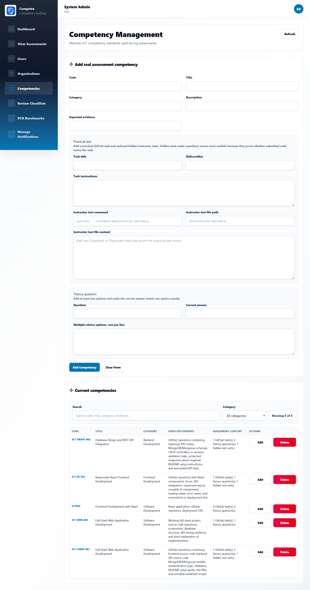

---

## Assessment Page


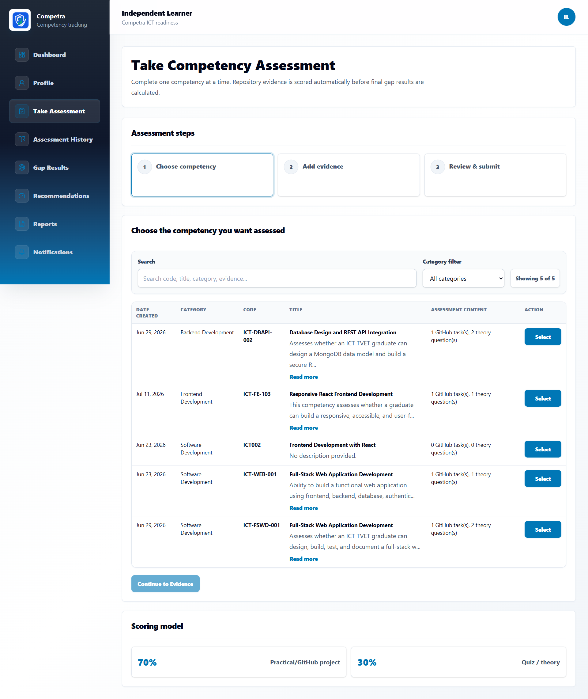

---


## Skill Gap Result


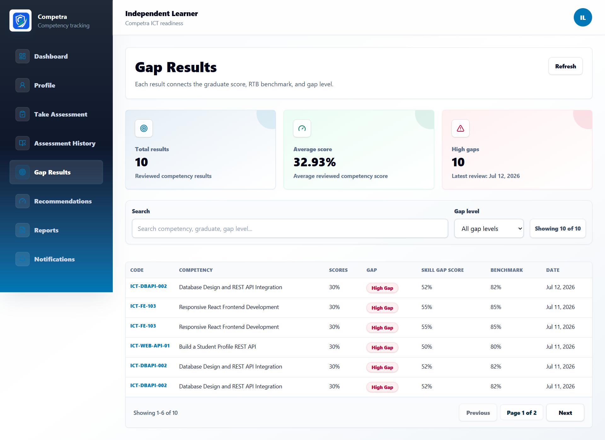

---
## view assessment result


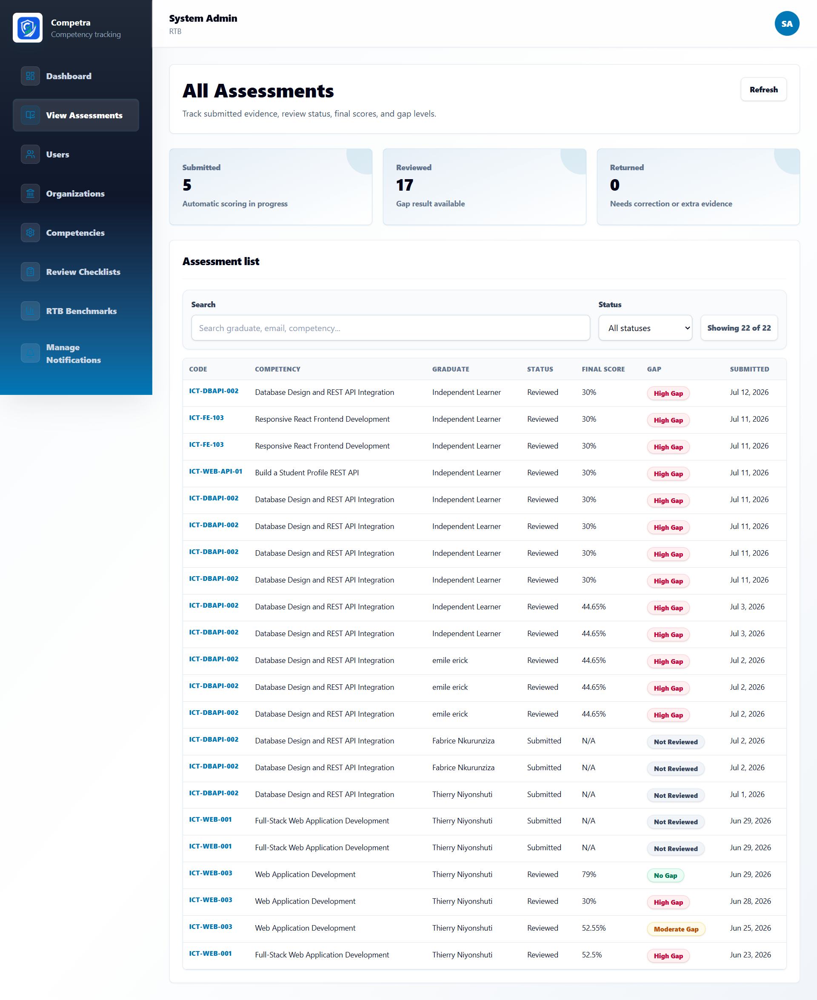

---

##  Recommendation


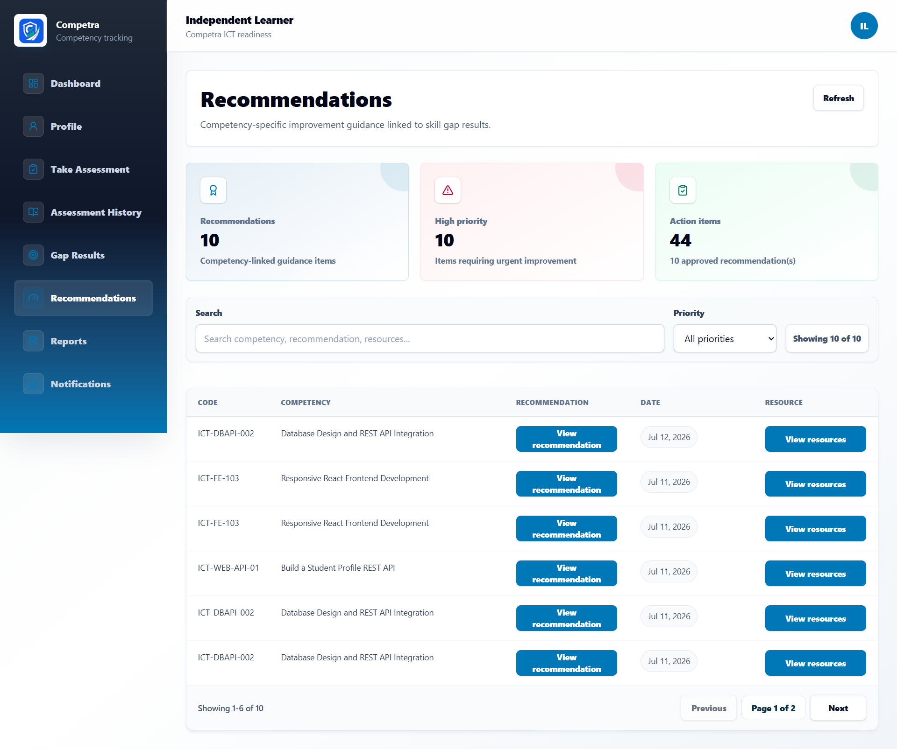

---

## Reports


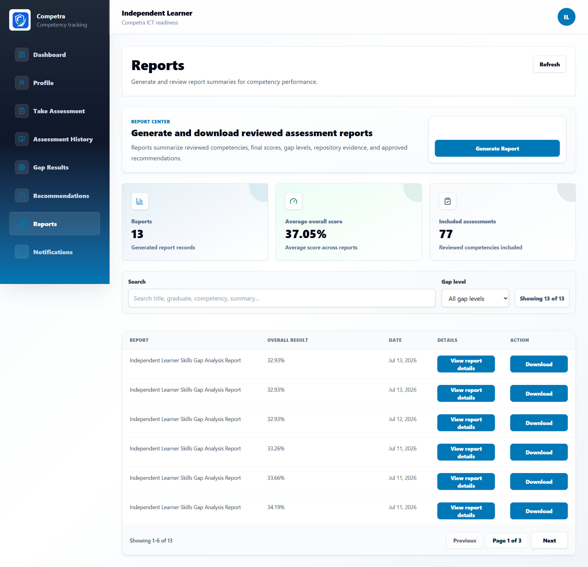

---

## Notifications


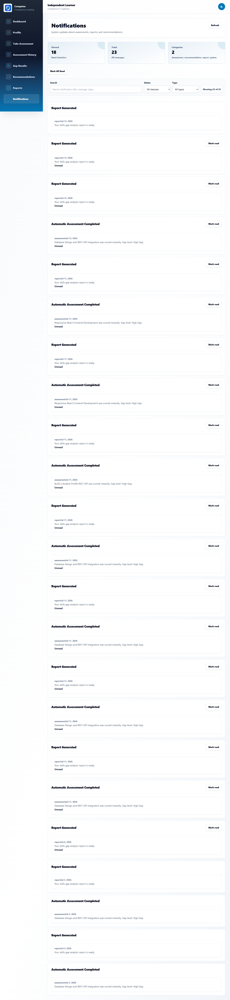


## User Roles

The active system roles are:

| Role                | Description                                                                                                                                            |
| ------------------- | ------------------------------------------------------------------------------------------------------------------------------------------------------ |
| `normal_user`       | Public learner account. Can register, complete profile, take assessments, view results, recommendations, reports, and notifications.                   |
| `organization_user` | Learner account linked to an organization. Can take assessments and view own results/reports.                                                          |
| `org_admin`         | Organization administrator. Can manage organization users and review organization-scoped assessment data.                                              |
| `admin`             | System administrator. Can manage organizations, organization admins, competencies, benchmarks, users, assessments, recommendations, and notifications. |
| `super_admin`       | Highest platform administrator. Can seed/manage platform-level admin access.                                                                           |

`assessor` exists only as a legacy role label in code for old data compatibility. New accounts should use the active roles above.

## Key Features

The system provides the following core functionalities:

- User authentication (Email/JWT and Google OAuth)
- Role-based access control
- Organization management
- Graduate profile management
- RTB competency management
- RTB benchmark management
- Practical GitHub repository assessment
- Theory assessment
- Automated repository review
- Automatic weighted score calculation
- Skill gap analysis
- AI-generated learning recommendations
- Notifications
- Downloadable reports
- Dashboards and analytics
- Password reset via email

## Core Workflow

1. User selects an RTB-aligned ICT competency.
2. User submits GitHub practical evidence repository and theory answers.
3. System securely tests the GitHub repository in an isolated execution sandbox and separately scores theory answers.
4. System combines practical and theory scores to calculate the final competency score.
5. System compares the final score with the RTB benchmark.
6. System calculates skill gap and classifies gap level.
7. System generates a Gemini recommendation based on practical performance, theory performance, strengths, weak areas, and the measured gap.
8. System notifies the user through in-app notification and email where configured.
9. System generates a report for the assessed user.


## Repository Evaluator Contract

Competra uses a controlled submission contract for automatic repository assessment. A submission can include `competra.json` so the system knows the language, runtime, commands, working directory, and observable input/output protocol. Admin-created competency checklists remain the primary scoring guide, while optional repository execution settings make automated tests more objective when a task provides runnable commands.

## Scoring Logic

```text
Final Score = (GitHub Practical Task Score x 0.70) + (Theory Score x 0.30)
```

```text
Skill Gap = RTB Benchmark Score - Final Graduate Score
```

If the skill gap is below zero, the system stores it as zero.

| Skill Gap | Classification |
| --------- | -------------- |
| 0         | No Gap         |
| 1-5       | Very Low Gap   |
| 6-15      | Low Gap        |
| 16-25     | Moderate Gap   |
| Above 25  | High Gap       |

## Project Structure

```text
RTB-Graduate-project/
  backend/
    src/
      app.js
      server.js
      config/
      constants/
      controllers/
      middleware/
      models/
      routes/
      scripts/
      services/
    tests/
    package.json
    .env.example

  my-project/
    src/
      api/
      assets/
      components/
      constants/
      context/
      pages/
      utils/
      App.tsx
      main.tsx
      types.ts
    package.json
```

## Backend Architecture

The backend uses a layered Express architecture:

```text
User / Frontend
   ->
server.js
   ->
app.js
   ->
routes
   ->
middleware
   ->
controllers
   ->
services
   ->
models
   ->
MongoDB Atlas
```

## Important Files

| File                                     | Purpose                                                                                                                                 |
| ---------------------------------------- | --------------------------------------------------------------------------------------------------------------------------------------- |
| `backend/src/server.js`                  | Starts the API server and connects to MongoDB.                                                                                          |
| `backend/src/app.js`                     | Configures Express, security middleware, CORS, rate limits, routes, and error handling.                                                 |
| `backend/src/config/db.js`               | Connects the API to MongoDB Atlas using environment variables.                                                                          |
| `backend/src/constants/roles.js`         | Defines active system roles and role-management rules.                                                                                  |
| `backend/src/routes/*.js`                | Defines API endpoints.                                                                                                                  |
| `backend/src/controllers/*.js`           | Handles request/response logic.                                                                                                         |
| `backend/src/services/*.js`              | Contains business logic for authentication, assessment, GitHub analysis, Gemini recommendation, reports, notifications, and dashboards. |
| `backend/src/models/*.js`                | Mongoose schemas.                                                                                                                       |
| `my-project/src/api/client.ts`           | Frontend API client.                                                                                                                    |
| `my-project/src/context/AuthContext.tsx` | Authentication state and token storage.                                                                                                 |
| `my-project/src/pages/AuthPages.tsx`     | Homepage, login, register, forgot password, and reset password pages.                                                                   |
| `my-project/src/pages/MainPages.tsx`     | Role-based dashboards and system pages.                                                                                                 |
| `my-project/src/components/common.tsx`   | Reusable UI components including cards, charts, buttons, and Read more/Read less text.                                                  |
| `my-project/src/components/layout.tsx`   | Sidebar, topbar, profile menu, and role navigation.                                                                                     |

## Prerequisites

- Node.js 20 or newer recommended.
- npm.
- MongoDB Atlas database.
- GitHub account and repository URLs for testing.
- Gemini API key.
- Brevo API key and verified sender email for production password reset email delivery.

## Backend Environment Variables

Create `backend/.env` from `backend/.env.example`.

```env
PORT=5000
HOST=0.0.0.0
API_PUBLIC_URL=http://localhost:5000/api
NODE_ENV=development
APP_NAME=Competra
LOCAL_DEVELOPMENT_HOSTS=localhost,127.0.0.1
MONGO_URI=mongodb+srv://<db_username>:<db_password>@<cluster-host>/rtb_skills_gap?retryWrites=true&w=majority
MONGO_DIRECT_URI=
JWT_SECRET=replace_with_a_long_random_secret
JWT_EXPIRES_IN_SECONDS=86400

PBKDF2_ITERATIONS=120000
PBKDF2_KEY_LENGTH=64
PBKDF2_DIGEST=sha512

DB_CONNECT_TIMEOUT_MS=8000
FRONTEND_URL=http://localhost:5173
# CORS is open in the backend API so any frontend application can send requests.
RATE_LIMIT_WINDOW_MS=900000
RATE_LIMIT_MAX_REQUESTS=300
AUTH_RATE_LIMIT_MAX_REQUESTS=20

PASSWORD_RESET_TOKEN_EXPIRES_MINUTES=15
TEMPORARY_PASSWORD_EXPIRES_HOURS=72
EXPOSE_PASSWORD_RESET_LINK_IN_RESPONSE=true

SUPER_ADMIN_NAME=System Admin
SUPER_ADMIN_EMAIL=admin@example.com
SUPER_ADMIN_PASSWORD=replace_with_a_strong_temporary_password
SUPER_ADMIN_INSTITUTION=RTB
SUPER_ADMIN_RESET_PASSWORD=false
SUPER_ADMIN_PROMOTE_EXISTING=false

EMAIL_PROVIDER=brevo
EMAIL_API_KEY=your_brevo_api_key
EMAIL_API_URL=
EMAIL_BREVO_API_URL=https://api.brevo.com/v3/smtp/email
EMAIL_REQUEST_TIMEOUT_MS=15000
EMAIL_FROM=no-reply@your-verified-domain.com
EMAIL_FROM_NAME=Competra
EMAIL_REPLY_TO=
EMAIL_TEST_TO=
TEST_EMAIL_TO=

GITHUB_TOKEN=
GITHUB_WEB_BASE_URL=https://github.com
GITHUB_API_URL=https://api.github.com
GITHUB_API_BASE_URL=https://api.github.com
GITHUB_RAW_BASE_URL=https://raw.githubusercontent.com
GITHUB_API_VERSION=2022-11-28
GITHUB_REQUEST_TIMEOUT_MS=10000
GITHUB_MAX_SAMPLED_FILES=6

REPOSITORY_ANALYSIS_TIMEOUT_MS=120000
TEMP_REPOSITORY_DIR=tmp/repositories
E2B_API_KEY=your_e2b_api_key
E2B_SANDBOX_TIMEOUT_MS=300000

GEMINI_API_KEY=
GEMINI_API_BASE_URL=https://generativelanguage.googleapis.com/v1beta/models
GEMINI_RECOMMENDATION_MODEL=gemini-2.5-flash
GEMINI_RECOMMENDATION_API_URL=

GOOGLE_CLIENT_ID=your-google-oauth-client-id.apps.googleusercontent.com
```

### Important Email Note

For Brevo, create an HTTP API key from SMTP & API > API keys and verify the sender email or domain in Brevo. To send reset links to users, set:

```env
EMAIL_PROVIDER=brevo
EMAIL_API_KEY=your_brevo_api_key
EMAIL_BREVO_API_URL=https://api.brevo.com/v3/smtp/email
EMAIL_REQUEST_TIMEOUT_MS=15000
EMAIL_FROM=no-reply@your-verified-domain.com
EMAIL_FROM_NAME=Competra
EMAIL_REPLY_TO=
```

## Frontend Environment Variables

Create `my-project/.env` if needed:

```env
VITE_API_URL=http://localhost:5000/api
VITE_GITHUB_INDIVIDUAL_PROJECT_PLACEHOLDER=https://github.com/username/project
VITE_GITHUB_ORGANIZATION_REPO_PLACEHOLDER=https://github.com/owner/repository
VITE_GOOGLE_CLIENT_ID=your-google-oauth-client-id.apps.googleusercontent.com
VITE_GOOGLE_IDENTITY_SCRIPT_URL=https://accounts.google.com/gsi/client
```

## Installation and Running Locally

Install backend dependencies:

```powershell
cd backend
npm install
```

Start backend:

```powershell
npm run dev
```

Backend URL:

```text
http://localhost:5000
```

Install frontend dependencies:

```powershell
cd my-project
npm install
```

Start frontend:

```powershell
npm run dev
```

Frontend URL:

```text
http://localhost:5173
```

## Useful Scripts

Backend:

| Command                     | Purpose                                    |
| --------------------------- | ------------------------------------------ |
| `npm run dev`               | Start backend with nodemon.                |
| `npm start`                 | Start backend with Node.                   |
| `npm run lint`              | Run backend ESLint.                        |
| `npm run check`             | Check backend server syntax.               |
| `npm test`                  | Run backend tests.                         |
| `npm run seed:admin`        | Create the first super admin from `.env`.  |
| `npm run seed:competency`   | Seed sample competency and benchmark data. |
| `npm run seed:database-api` | Seed database/API competency data.         |
| `npm run test:brevo`        | Test Brevo password reset email configuration. |

Frontend:

| Command           | Purpose                    |
| ----------------- | -------------------------- |
| `npm run dev`     | Start Vite frontend.       |
| `npm run build`   | Build production frontend. |
| `npm run lint`    | Run frontend ESLint.       |
| `npm test`        | Run frontend Vitest tests. |
| `npm run preview` | Preview production build.  |

## First-Time Setup Order

1. Create MongoDB Atlas cluster and database user.
2. Add your current IP address to Atlas Network Access.
3. Create `backend/.env`.
4. Set `MONGO_URI`, `JWT_SECRET`, and `FRONTEND_URL`. `FRONTEND_URL` is used for password reset links; API CORS is open for frontend clients.
5. Add `GITHUB_TOKEN` if private repository access or higher rate limit is needed.
6. Add `GEMINI_API_KEY`.
7. Configure Brevo email values if password reset emails must be delivered.
8. Run backend `npm install`.
9. Run `npm run seed:admin`.
10. Run backend `npm run dev`.
11. Create `my-project/.env` with `VITE_API_URL=http://localhost:5000/api`. Add `VITE_GOOGLE_CLIENT_ID` when Google sign-in is enabled.
12. Run frontend `npm install`.
13. Run frontend `npm run dev`.
14. Login with the seeded super admin account.
15. Create organizations, organization admins, competencies, and benchmarks.

## Account Creation Logic

- Public users can register learner accounts from the frontend and select an organization when applicable.
- Super admin can create platform admin accounts.
- Admin can create organizations and organization admin accounts.
- Organization admin can create organization user accounts.
- Admins and organization admins should not reset passwords for created users. Created users use the forgot-password flow to set or reset their own password.

## Main API Base URL

```text
http://localhost:5000/api
```

Protected routes require:

```http
Authorization: Bearer <JWT_TOKEN>
Content-Type: application/json
```

## API Route Summary

### Health

| Method | Endpoint  | Access |
| ------ | --------- | ------ |
| GET    | `/health` | Public |

### Authentication

| Method | Endpoint                | Access        |
| ------ | ----------------------- | ------------- |
| POST   | `/auth/register`        | Public        |
| POST   | `/auth/login`           | Public        |
| POST   | `/auth/google`          | Public        |
| POST   | `/auth/forgot-password` | Public        |
| POST   | `/auth/reset-password`  | Public        |
| GET    | `/auth/me`              | Authenticated |
| PATCH  | `/auth/change-password` | Authenticated |

Register learner example:

```json
{
  "name": "Thierry Niyonshuti",
  "email": "thierry@example.com",
  "password": "StrongPass123!",
  "role": "normal_user",
  "institution": "IPRC Kigali",
  "organization": "ORGANIZATION_ID"
}
```

Login example:

```json
{
  "email": "thierry@example.com",
  "password": "StrongPass123!"
}
```

Google sign-in example:

```json
{
  "credential": "GOOGLE_ID_TOKEN_FROM_FRONTEND"
}
```

Forgot password example:

```json
{
  "email": "thierry@example.com"
}
```

Reset password example:

```json
{
  "token": "PASSWORD_RESET_TOKEN",
  "newPassword": "NewStrongPass123!"
}
```

### Organizations

| Method | Endpoint                | Access                    |
| ------ | ----------------------- | ------------------------- |
| GET    | `/organizations/public` | Public                    |
| GET    | `/organizations`        | Admin, Organization Admin |
| POST   | `/organizations`        | Admin                     |
| GET    | `/organizations/:id`    | Admin, Organization Admin |
| PUT    | `/organizations/:id`    | Admin                     |
| DELETE | `/organizations/:id`    | Admin                     |

Create organization example:

```json
{
  "name": "Kicukiro TVET ICT Center",
  "district": "Kicukiro",
  "sector": "Niboye",
  "email": "info@kicukirotvet.rw",
  "phone": "+250788000000"
}
```

### Users

| Method | Endpoint                | Access                    |
| ------ | ----------------------- | ------------------------- |
| GET    | `/users`                | Admin, Organization Admin |
| POST   | `/users`                | Admin, Organization Admin |
| GET    | `/users/:id`            | Admin, Organization Admin |
| PUT    | `/users/:id`            | Admin, Organization Admin |
| DELETE | `/users/:id`            | Admin, Organization Admin |
| PATCH  | `/users/:id/deactivate` | Admin, Organization Admin |

Create organization admin example:

```json
{
  "name": "Organization Admin",
  "email": "orgadmin@example.com",
  "password": "TempPass123!",
  "role": "org_admin",
  "institution": "Kicukiro TVET ICT Center",
  "organization": "ORGANIZATION_ID"
}
```

Create organization user example:

```json
{
  "name": "Organization Learner",
  "email": "learner@example.com",
  "password": "TempPass123!",
  "role": "organization_user",
  "institution": "Kicukiro TVET ICT Center",
  "organization": "ORGANIZATION_ID"
}
```

### Graduate Profiles

| Method | Endpoint             | Access                    |
| ------ | -------------------- | ------------------------- |
| GET    | `/graduates/me`      | Learner                   |
| PUT    | `/graduates/me`      | Learner                   |
| DELETE | `/graduates/me`      | Learner                   |
| GET    | `/graduates`         | Admin, Organization Admin |
| GET    | `/graduates/:userId` | Admin, Organization Admin |
| DELETE | `/graduates/:userId` | Admin                     |

Profile example:

```json
{
  "registrationNumber": "TVET-ICT-2026-001",
  "phone": "+250788000000",
  "gender": "male",
  "district": "Kicukiro",
  "sector": "Niboye",
  "institution": "IPRC Kigali",
  "program": "ICT",
  "graduationYear": 2026,
  "specialization": "Web Development",
  "bio": "ICT learner focused on full-stack web development."
}
```

### Competencies

| Method | Endpoint            | Access        |
| ------ | ------------------- | ------------- |
| GET    | `/competencies`     | Authenticated |
| POST   | `/competencies`     | Admin         |
| GET    | `/competencies/:id` | Authenticated |
| PUT    | `/competencies/:id` | Admin         |
| DELETE | `/competencies/:id` | Admin         |

Create competency example:

```json
{
  "title": "Full-Stack Web Application Development",
  "code": "ICT-FSWD-001",
  "category": "Software Development",
  "description": "Ability to design, build, test, and document a full-stack web application.",
  "expectedEvidence": "GitHub repository, README, implementation screenshots, source code, theory answers, and project explanation.",
  "practicalTasks": [
    {
      "title": "Build a Graduate Profile Management Module",
      "instructions": "Create a working module that allows a user to register, login, update profile information, and view saved profile details.",
      "deliverables": "GitHub repository URL, README setup instructions, screenshots, API endpoint list, MongoDB collection screenshot, and short JWT authentication explanation.",
      "estimatedMinutes": 120,
      "maxScore": 100
    }
  ],
  "theoryQuestions": [
    {
      "question": "Which HTTP method is commonly used to update an existing resource?",
      "type": "multiple_choice",
      "options": ["GET", "POST", "PUT", "DELETE"],
      "correctAnswer": "PUT",
      "points": 5
    },
    {
      "question": "Explain why validation is important before saving profile data.",
      "type": "short_answer",
      "expectedAnswer": "Validation improves data integrity, protects the system from invalid input, and gives users clear feedback.",
      "points": 10
    }
  ],
  "isActive": true
}
```

### RTB Benchmarks

| Method | Endpoint          | Access        |
| ------ | ----------------- | ------------- |
| GET    | `/benchmarks`     | Authenticated |
| POST   | `/benchmarks`     | Admin         |
| GET    | `/benchmarks/:id` | Authenticated |
| PUT    | `/benchmarks/:id` | Admin         |
| DELETE | `/benchmarks/:id` | Admin         |

Create benchmark example:

```json
{
  "competency": "COMPETENCY_ID",
  "requiredScore": 80,
  "level": "intermediate",
  "description": "Minimum RTB-aligned score expected for employable full-stack web application development competency.",
  "effectiveFrom": "2026-01-01",
  "isActive": true
}
```

### Assessments

| Method | Endpoint                                  | Access                             |
| ------ | ----------------------------------------- | ---------------------------------- |
| GET    | `/assessments`                            | Authenticated                      |
| POST   | `/assessments`                            | Learner                            |
| POST   | `/assessments/repository-task-review`     | Learner                            |
| GET    | `/assessments/results/me`                 | Learner                            |
| GET    | `/assessments/:id`                        | Authenticated                      |
| PUT    | `/assessments/:id`                        | Learner, Admin, Organization Admin |
| DELETE | `/assessments/:id`                        | Learner, Admin, Organization Admin |
| PUT    | `/assessments/:id/review`                 | Admin                              |
| POST   | `/assessments/:id/recommendation-preview` | Admin                              |

Repository task review example:

```json
{
  "competency": "COMPETENCY_ID",
  "practicalTaskId": "PRACTICAL_TASK_ID",
  "githubRepositoryUrl": "https://github.com/owner/repository"
}
```

Submit assessment example:

```json
{
  "competency": "COMPETENCY_ID",
  "practicalTaskId": "PRACTICAL_TASK_ID",
  "practicalSubmissionMode": "github_repository",
  "practicalTask": "I completed the assigned module and pushed the source code to GitHub.",
  "githubRepositoryUrl": "https://github.com/owner/repository",
  "theoryAnswers": [
    {
      "questionId": "QUESTION_ID_1",
      "answer": "PUT"
    },
    {
      "questionId": "QUESTION_ID_2",
      "answer": "Validation improves data integrity and protects the system from invalid input."
    }
  ]
}
```

Review assessment example:

```json
{
  "practicalTaskScore": 82,
  "quizScore": 70,
  "assessorComment": "The repository shows functional CRUD behavior, but validation and test coverage should be improved.",
  "evidenceVerification": {
    "githubReviewed": true,
    "practicalEvidenceReviewed": true,
    "theoryReviewed": true,
    "authenticityNotes": "Repository, source files, README, and theory answers were reviewed."
  },
  "recommendation": {
    "message": "Improve validation, error handling, and testing to close the remaining competency gap.",
    "actionItems": [
      "Add server-side validation.",
      "Add tests for authentication and profile update workflows."
    ],
    "resources": ["Express validation documentation", "React testing guide"]
  }
}
```

### Repository Assessments

| Method | Endpoint                      | Access         |
| ------ | ----------------------------- | -------------- |
| GET    | `/repository-assessments`     | Authenticated  |
| POST   | `/repository-assessments`     | Learner, Admin |
| GET    | `/repository-assessments/:id` | Authenticated  |
| PUT    | `/repository-assessments/:id` | Admin          |
| DELETE | `/repository-assessments/:id` | Authenticated  |

### Recommendations

| Method | Endpoint           | Access                             |
| ------ | ------------------ | ---------------------------------- |
| GET    | `/recommendations` | Learner, Organization Admin, Admin |

Recommendations are generated through Gemini during:

```text
POST /api/assessments/:id/recommendation-preview
PUT /api/assessments/:id/review
```

### Reports

Reports are learner-owned in the current system.

| Method | Endpoint       | Access  |
| ------ | -------------- | ------- |
| GET    | `/reports`     | Learner |
| POST   | `/reports`     | Learner |
| GET    | `/reports/:id` | Learner |
| DELETE | `/reports/:id` | Learner |

### Notifications

| Method | Endpoint                  | Access        |
| ------ | ------------------------- | ------------- |
| GET    | `/notifications`          | Authenticated |
| POST   | `/notifications`          | Admin         |
| GET    | `/notifications/manage`   | Admin         |
| PATCH  | `/notifications/read-all` | Authenticated |
| PATCH  | `/notifications/:id/read` | Authenticated |
| GET    | `/notifications/:id`      | Authenticated |
| PUT    | `/notifications/:id`      | Admin         |
| DELETE | `/notifications/:id`      | Authenticated |

### Dashboard

| Method | Endpoint     | Access        |
| ------ | ------------ | ------------- |
| GET    | `/dashboard` | Authenticated |

Dashboard charts use real system data from users, assessments, benchmarks, reports, recommendations, and notifications.

## GitHub Repository Review

The GitHub review checks repository evidence such as:

- Repository accessibility.
- README and documentation.
- Supported source files.
- Relevant implementation signals.
- Practical task checklist.
- Technology detection.
- Code quality signals.
- Testing evidence where available.
- CI/GitHub Actions proof when available.
- Security and risk flags where available.

The score is based on objective review signals and task checklist evidence. Fully proving all functionality may still require assessor validation when automatic verification cannot confirm a requirement.

## Gemini Recommendation Integration

Gemini recommendations use:

- Selected competency.
- RTB benchmark.
- Practical/GitHub score.
- Theory score.
- Final score.
- Skill gap.
- Gap level.
- Weak areas.
- GitHub repository summary.
- Assessor comments.

Gemini is expected to be configured with:

```env
GEMINI_API_KEY=your_key
GEMINI_RECOMMENDATION_MODEL=gemini-2.5-flash
GEMINI_RECOMMENDATION_API_URL=
```

Leave `GEMINI_RECOMMENDATION_API_URL` empty unless you intentionally want to override the default Google Generative Language endpoint.

## Postman Quick Test Flow

1. `GET /api/health`
2. `POST /api/auth/login`
3. Copy token into Bearer Token authorization.
4. `GET /api/organizations/public`
5. `POST /api/competencies` as admin.
6. `POST /api/benchmarks` as admin.
7. `POST /api/assessments/repository-task-review` as learner.
8. `POST /api/assessments` as learner.
9. `POST /api/assessments/:id/recommendation-preview` as admin.
10. `PUT /api/assessments/:id/review` as admin.
11. `GET /api/recommendations`
12. `POST /api/reports` as learner.
13. `GET /api/notifications`

# Testing Strategy

The application was evaluated using multiple software testing strategies to verify functionality, correctness, usability, and reliability.

| Testing Strategy | Purpose |
|------------------|---------|
| Unit Testing | Verify individual functions and modules |
| Integration Testing | Verify communication between frontend, backend, and database |
| Functional Testing | Verify core business workflows |
| Validation Testing | Verify user input validation |
| Repository Review Testing | Verify automated GitHub repository evaluation |
| Performance Testing | Evaluate response time and application performance |
| Responsive Testing | Verify compatibility across different screen sizes and browsers |
# Testing Results

## Unit Testing


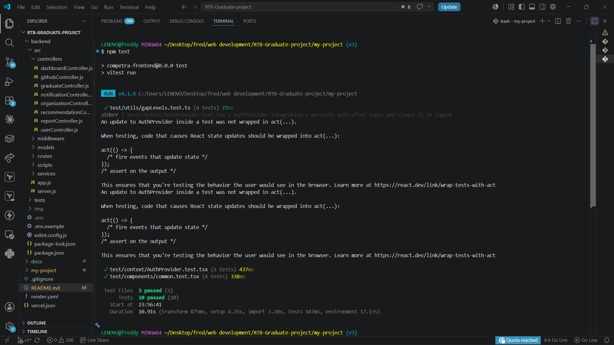

---

## Integration Testing


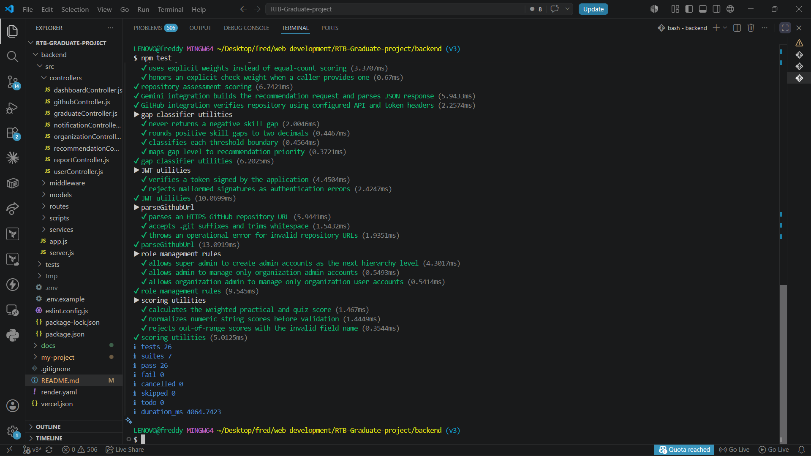

---


## Validation Testing


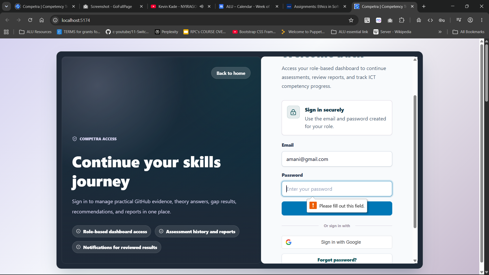

---

## Performance Testing


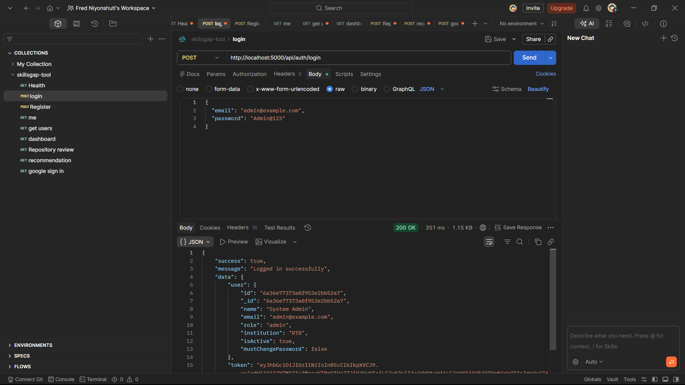

# Cross-Platform Compatibility

The system was tested in multiple environments.

| Platform | Browser | Status |
|-----------|----------|--------|
| Windows 11 | Chrome | Passed |
| Windows 11 | Microsoft Edge | Passed |
| Android | Chrome | Passed |
| Tablet | Chrome | Passed |

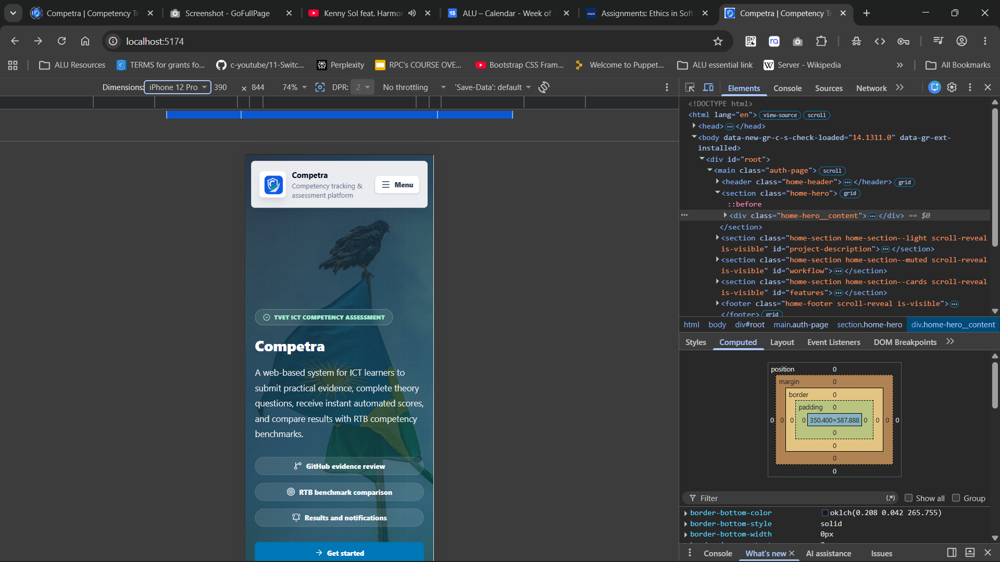


## Testing External APIs

### GitHub API

```http
GET https://api.github.com/repos/OWNER/REPO
```

Headers:

```http
Accept: application/vnd.github+json
X-GitHub-Api-Version: 2022-11-28
Authorization: Bearer YOUR_GITHUB_TOKEN
```

### Gemini API

```http
POST https://generativelanguage.googleapis.com/v1beta/models/gemini-2.5-flash:generateContent?key=YOUR_GEMINI_API_KEY
```

Body:

```json
{
  "contents": [
    {
      "parts": [
        {
          "text": "Generate a short recommendation for an ICT learner with final score 72, benchmark 80, and low gap."
        }
      ]
    }
  ]
}
```

## Database Models

| Model                      | Purpose                                                                      |
| -------------------------- | ---------------------------------------------------------------------------- |
| User                       | Account, role, organization, password hash, active status, reset tokens.     |
| Organization               | TVET institution or organization records.                                    |
| GraduateProfile            | Learner academic and profile data.                                           |
| Competency                 | ICT competency, practical tasks, theory questions, evidence requirements.    |
| Benchmark                  | RTB required score for a competency.                                         |
| Assessment                 | Evidence, GitHub summary, theory answers, scores, gap result, review status. |
| RepositoryAssessmentResult | Standalone automated repository assessment results.                          |
| Recommendation             | Gemini draft and approved performance guidance.                              |
| Report                     | Generated learner report summaries.                                          |
| Notification               | User and system notifications.                                               |

## UI/UX Notes

- Frontend styling uses Tailwind CSS.
- Dashboards use real data charts through Recharts.
- Long content uses Read more/Read less controls and detail modals to keep cards and tables clean.
- Gap results, recommendations, and reports use clean table layouts with modal windows for long details and resource lists.
- The profile icon opens a hover account menu with email, role, profile, dashboard, and logout actions.
- Layouts are responsive for desktop, tablet, and mobile.

## Render Deployment Settings

Deploy the backend and frontend as separate Render services because this project is a two-folder application.

# Deployment Verification

The application was successfully deployed.

## Frontend

Vercel

https://rtb-graduate-project.vercel.app/

## Backend

Render

https://rtb-graduate-project.onrender.com

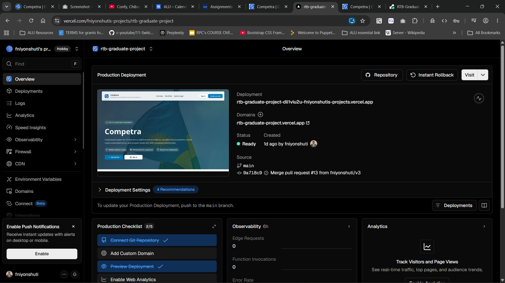
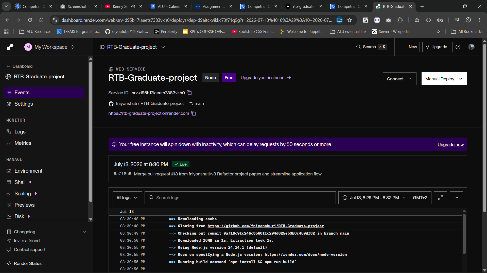

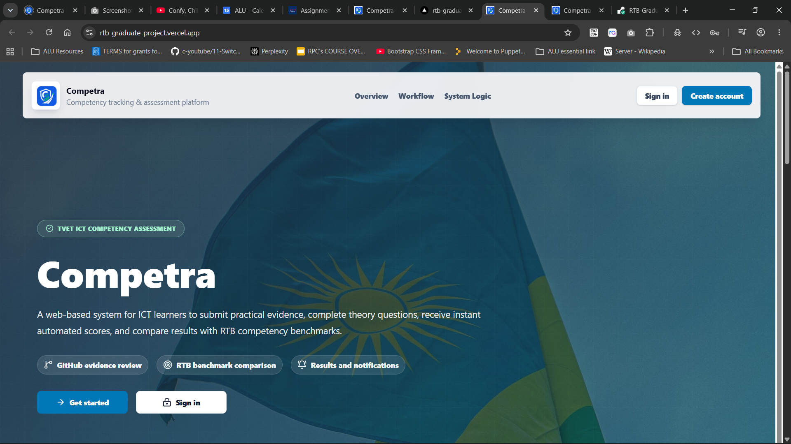


### Backend Web Service

| Setting        | Value                          |
| -------------- | ------------------------------ |
| Root Directory | `backend`                      |
| Build Command  | `npm install && npm run build` |
| Start Command  | `npm start`                    |

Required backend environment variables include:

```env
NODE_ENV=production
HOST=0.0.0.0
API_PUBLIC_URL=https://rtb-graduate-project.onrender.com/api
MONGO_URI=your_mongodb_atlas_uri
MONGO_DIRECT_URI=optional_standard_atlas_mongodb_uri
JWT_SECRET=your_strong_secret
FRONTEND_URL=https://rtb-graduate-project.vercel.app
# CORS is open in the backend API so any frontend application can send requests.
GITHUB_API_URL=https://api.github.com
GITHUB_API_BASE_URL=https://api.github.com
GITHUB_RAW_BASE_URL=https://raw.githubusercontent.com
GITHUB_WEB_BASE_URL=https://github.com
GITHUB_TOKEN=optional_for_private_repositories
GEMINI_API_KEY=your_gemini_key
GEMINI_API_BASE_URL=https://generativelanguage.googleapis.com/v1beta/models
GEMINI_RECOMMENDATION_MODEL=gemini-2.5-flash
GOOGLE_CLIENT_ID=your-google-oauth-client-id.apps.googleusercontent.com
EMAIL_PROVIDER=brevo
EMAIL_API_KEY=your_brevo_api_key
EMAIL_BREVO_API_URL=https://api.brevo.com/v3/smtp/email
EMAIL_REQUEST_TIMEOUT_MS=15000
EMAIL_FROM=noreply@your-verified-domain.com
EMAIL_FROM_NAME=Competra
EMAIL_REPLY_TO=
EXPOSE_PASSWORD_RESET_LINK_IN_RESPONSE=false
E2B_API_KEY=your_e2b_api_key
E2B_SANDBOX_TIMEOUT_MS=300000
```

### Frontend Static Site

| Setting           | Value                          |
| ----------------- | ------------------------------ |
| Root Directory    | `my-project`                   |
| Build Command     | `npm install && npm run build` |
| Publish Directory | `dist`                         |

Required frontend environment variables:

```env
VITE_API_URL=https://your-backend-url/api
VITE_GOOGLE_CLIENT_ID=your-google-oauth-client-id.apps.googleusercontent.com
VITE_GOOGLE_IDENTITY_SCRIPT_URL=https://accounts.google.com/gsi/client
```

For your current deployed backend, Vercel should use:

```env
VITE_API_URL=https://rtb-graduate-project.onrender.com/api
```

## Troubleshooting

### Render build fails with Missing script: "build"

This happens when Render runs `npm run build` in a folder whose `package.json` does not define a build script.

Use these settings:

- Backend service root directory: `backend`
- Backend build command: `npm install && npm run build`
- Backend start command: `npm start`
- Do not use `npm run dev` on Render. It is for local development only.
- Frontend static site root directory: `my-project`
- Frontend build command: `npm install && npm run build`
- Frontend publish directory: `dist`

### Render starts with npm run dev and no port opens

This happens when the Render service Start Command is set to the local development command.

Use:

```text
npm start
```

The repository also includes `render.yaml`, which sets the backend start command to `npm start` for Render Blueprint deployments.

If Render still reports no open port, check the runtime logs above the port scan message. The backend must connect to MongoDB and finish configuration validation before it can bind to `process.env.PORT`.

### Backend cannot connect to MongoDB Atlas

Check:

- `MONGO_URI` is correct.
- Atlas username and password are correct.
- Special characters in password are URL-encoded.
- Atlas Network Access allows your IP address.
- The database user has read/write permission.
- Internet connection is working.

If Windows DNS resolves Atlas but Node.js still fails with:

```text
querySrv ECONNREFUSED _mongodb._tcp...
```

use the standard Atlas connection string instead of the SRV string.

In MongoDB Atlas:

```text
Database > Connect > Drivers > Show advanced connection options
```

Copy the connection string that starts with:

```env
MONGO_DIRECT_URI=mongodb://...
```

This avoids the `_mongodb._tcp` SRV lookup used by:

```env
MONGO_URI=mongodb+srv://...
```

Keep `MONGO_URI` in `.env`, but add `MONGO_DIRECT_URI`. When `MONGO_DIRECT_URI` is set, the backend uses it first. Keep the same Atlas username, password, database name, and options. If the password contains special characters, URL-encode it before saving it in `.env`.

### Frontend cannot connect to API

Check:

- Backend health endpoint returns success: `https://rtb-graduate-project.onrender.com/api/health`.
- Vercel has `VITE_API_URL=https://rtb-graduate-project.onrender.com/api`.
- Render has `FRONTEND_URL=https://rtb-graduate-project.vercel.app`.
- The Render backend is redeployed with the latest open-CORS backend code.
- Both Render and Vercel were redeployed after environment variables changed.

### Password reset email fails

Check:

- `EMAIL_PROVIDER=brevo`.
- `EMAIL_API_KEY` is set.
- `EMAIL_FROM` uses a sender email or domain verified in Brevo for production delivery.
- Backend was restarted after editing `.env`.

### Gemini recommendation fails

Check:

- `GEMINI_API_KEY` is valid.
- `GEMINI_RECOMMENDATION_MODEL=gemini-2.5-flash`.
- Backend has internet access.
- Gemini quota is not exhausted.

### GitHub repository review fails

Check:

- URL format is `https://github.com/owner/repository`.
- Repository is public, or `GITHUB_TOKEN` has access.
- GitHub rate limit is not exceeded.
- Repository contains supported source files and README evidence.

# Analysis

The testing results demonstrate that the system successfully implements the objectives defined in the project proposal.

The weighted scoring algorithm correctly calculates graduate competency scores using repository review and theory assessment results.

The system accurately compares competency scores against RTB benchmark scores to determine competency gaps and automatically classifies graduates into appropriate gap levels.

AI-generated recommendations provide personalized guidance based on identified competency gaps.

The testing also confirmed that the application functions correctly across supported browsers and devices while maintaining acceptable performance.

Limitations observed during testing include:

- Repository analysis depends on GitHub repository accessibility.
- AI recommendations require internet connectivity.
- Repository execution is limited to supported project configurations.

# Discussion

The milestones achieved demonstrate that Competra successfully automates competency assessment using objective evidence rather than relying solely on self-assessment.

The integration of GitHub repository review, automated scoring, RTB benchmark comparison, and AI-generated recommendations provides graduates with meaningful feedback while reducing manual assessment effort.

The project contributes toward improving competency evaluation within ICT TVET education and supports graduates in identifying areas requiring improvement before entering the workforce.

# Recommendations

Future improvements may include:

- Support additional programming languages.
- Integrate directly with RTB competency databases.
- Add employer dashboards.
- Add mobile application support.
- Improve repository execution sandbox.
- Introduce plagiarism detection.
- Add interview simulation using AI.
- Provide personalized learning roadmaps.
# Known Limitations

Current limitations include:

- Repository review requires accessible GitHub repositories.
- AI recommendations require Gemini API availability.
- Offline assessment is not currently supported.
- Repository execution supports only configured environments.
# Future Work

Future development will focus on:

- Real-time RTB integration.
- Employer feedback integration.
- AI interview assessment.
- Learning management system integration.
- Advanced analytics dashboards.
- Multi-language support.
- Mobile application development.

## Production Readiness Checklist

- Use a strong `JWT_SECRET`.
- Use a verified sender email or domain in Brevo.
- Disable `EXPOSE_PASSWORD_RESET_LINK_IN_RESPONSE` in production.
- Keep backend CORS open only if the API is intended to support multiple frontend clients; protect data with JWT authorization and role checks.
- Restrict MongoDB Atlas network access.
- Use HTTPS.
- Set `E2B_API_KEY` so repository code is executed only inside an E2B isolated sandbox.
- Store environment variables securely.
- Add cloud file storage if large uploads are required.
- Monitor GitHub and Gemini API quota.
- Run backend and frontend lint/tests before release.


